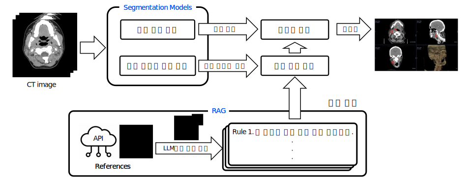
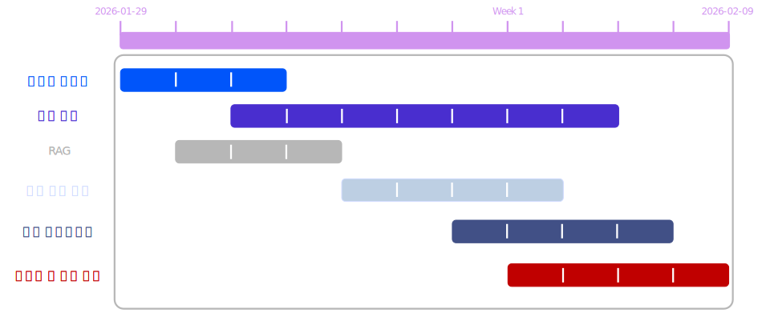
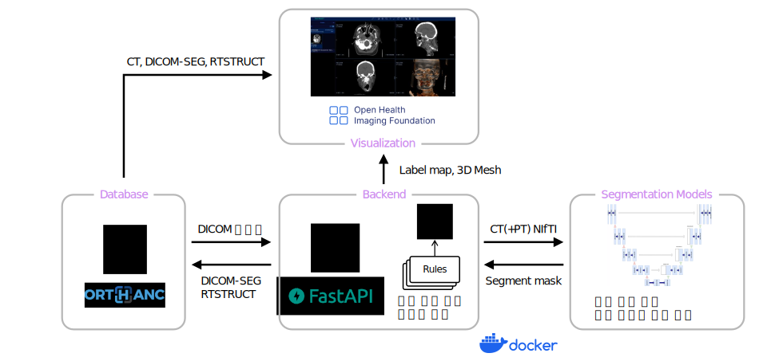
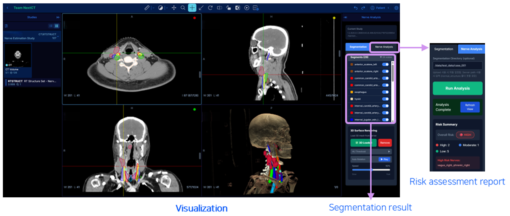

# 두경부 CT 기반 신경 경로 추정 및 종양-신경 위험도 시각화 시스템

CT/PET 영상에서 두경부 신경 경로를 추정하고, 종양과의 근접도를 분석하여 수술 위험도를 평가하는 의료 영상 플랫폼.

---

## 1. Project Overview

  

본 프로젝트는 두경부 수술에서 CT 영상만으로는 직접 관찰이 어려운 **신경 구조를 자동으로 추정**하고, **종양–신경 간 위험도를 정량적으로 평가**하여 **웹 기반 2D/3D 시각화로 제공하는 수술 보조 시스템**입니다.

본 프로젝트는 다음 문제의식에서 출발했습니다.

- CT에서 신경이 직접 보이지 않아, 외과의가 해부학적 경험에 의존
- 수술 전 위험 영역을 직관적으로 파악할 수 있는 도구의 부재
- 분할 결과를 실제 임상 워크플로우에서 활용하기 어려운 구조

이를 해결하기 위해 **AI 기반 자동 분할 + 신경 경로 추정 + 위험도 평가 + 웹 시각화**를 하나의 end-to-end 파이프라인으로 통합했습니다.

---

## 2. Team & Roles

| Name | Role | GitHub |
|---|---|---|
| 박진웅 | 프로젝트 제안, 신경 추정 및 위험도 로직, 서비스 아키텍처 설계, 웹 시각화 파이프라인 구축, 데이터 라벨링 | [Link](https://github.com/pjw6173) |
| 이다현 | Total Segmentator v2 옵션 테스트 및 정상 구조물 분할 모델 파이프라인 설계, ResEnc 적용,  Custom Generalized Surface Loss 활용 nnU-Net 성능 개선 | [Link](https://github.com/dahyun22) |
| 정대현 | nnU-Net 기반 정상 구조물 분할 모델링, Generalized Surface Loss를 활용한 모델 훈련, NifTi 파일 분석 | [Link](https://github.com/jdmunkres23) |
| 최재민 | PET-CT 기반 전처리 및 병변 분할 모델링, Docker compose를 활용한 추론 파이프라인 구축, 이미지 후처리 | [Link](https://github.com/jaeminld) |
| 한승범 | CT 기반 ResEnc U-Net 병변 분할 모델링, GCS, GCE 활용, 이미지 후처리 | [Link](https://github.com/nalimeitb) |

## 3. Project Timeline

  

프로젝트는 데이터 분석부터 모델링, 시스템 통합, 성능 최적화까지 단계적으로 진행되었습니다.

---

## 4. System & Service Architecture

시스템 아키텍처는 **Docker Compose 기반 멀티 서비스 아키텍처**로 구성됩니다.

- **Backend**: FastAPI (파이프라인 오케스트레이션)
- **AI Inference**: nnU-Net, TotalSegmentator, STU-Net
- **DICOM Server**: Orthanc
- **Viewer**: OHIF Viewer 

CT 업로드 이후, 정상 구조물 분할 → 종양 분할 → 신경 추정 → 위험도 평가가 실행되며, 결과는 DICOM 및 웹 시각화 형태로 제공됩니다.

---

## 5. Model Results

### Tumor Segmentation
- CT-only 모델과 PET-CT 기반 모델을 모두 설계
- PET-CT 기반 STU-Net 모델에서 가장 높은 Dice Score(0.7128) 달성
- 후처리(label integration)로 추가 성능 개선(0.7616)

### Normal Structure Segmentation
- Dice + HD95를 동시에 고려한 경계 중심 학습 전략
- ResEnc + Generalized Surface Loss (absolute) 최종 채택
- 신경 거리 계산 안정성 확보에 초점

자세한 내용은 PPT의 Appendix 참고해주세요. 

---

## 6. Visualization

브라우저 환경에서 다음 시각화를 제공합니다.

- **2D MPR (Axial / Sagittal / Coronal)**  
  - NIfTI labelmap 기반 on-demand contour 생성
- **3D Surface Rendering**  
  - 서버에서 생성한 메쉬를 VTK.js로 렌더링
- **신경 경로 및 위험도 표시**  
  - HIGH / MODERATE / LOW 등급 시각화

브라우저 메모리 한계를 고려하여 **무거운 연산은 서버에서 처리하고, 클라이언트는 렌더링만 담당**하도록 설계했습니다.

---

## 7. Conclusion

본 프로젝트는 단순한 분할 성능 향상을 넘어서,

- **임상 문제에서 출발한 AI 설계**
- **종양–신경 관계를 정량화한 위험도 평가**
- **실제 수술 전 의사결정을 돕는 시각화 시스템**

을 하나의 파이프라인으로 구현한 프로젝트입니다.

향후 과제로는  
- 신경 경로에 대한 정량적 검증 데이터 확보  
- 인종·해부학적 변이를 고려한 일반화  
- 실제 임상 환경에서의 사용자 평가  

가 남아 있으며, 이를 통해 실사용 가능한 수술 보조 시스템으로 확장할 수 있습니다.

[프로젝트 발표 자료 (PDF)](./assets/Next-CT_Final_project.pdf)
